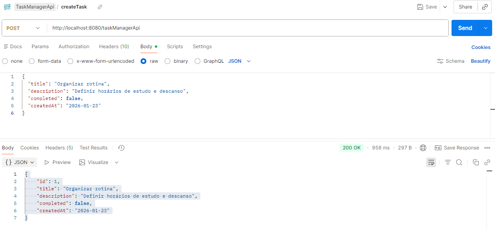
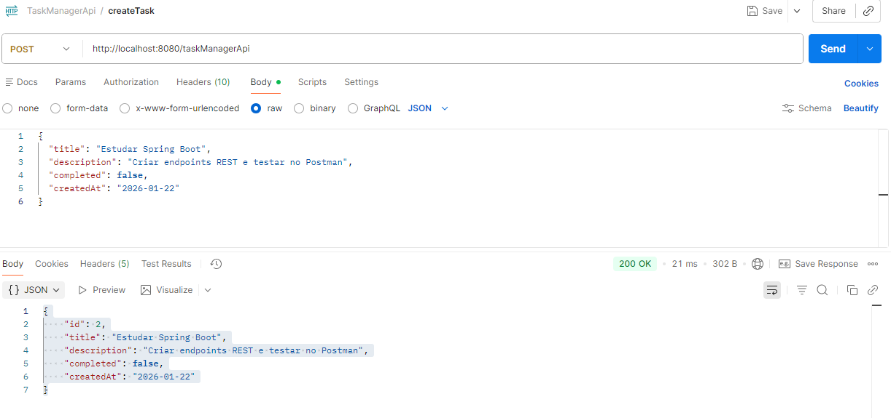
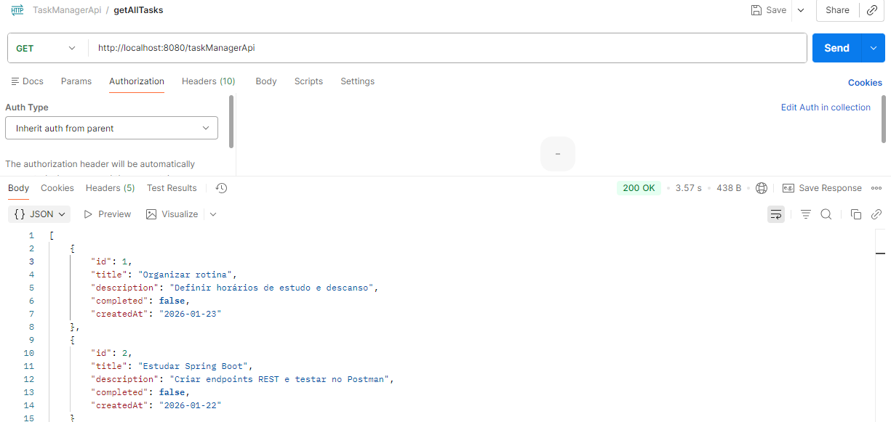
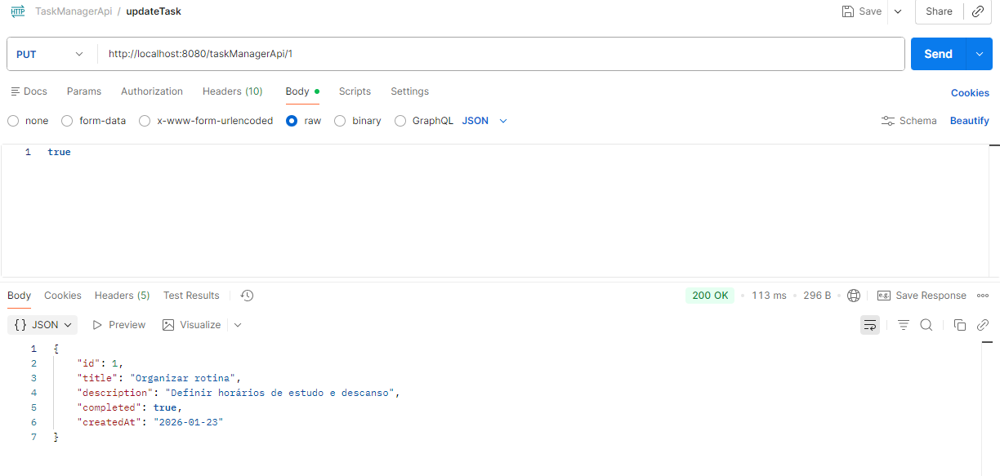
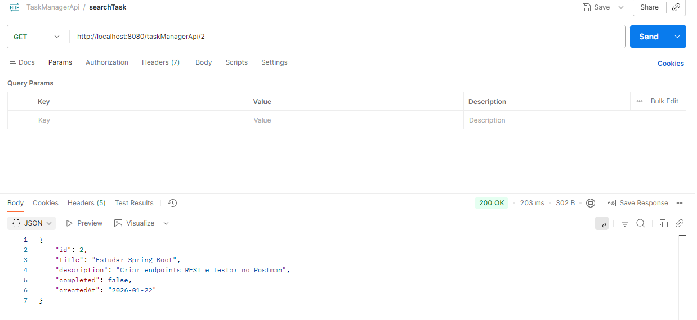
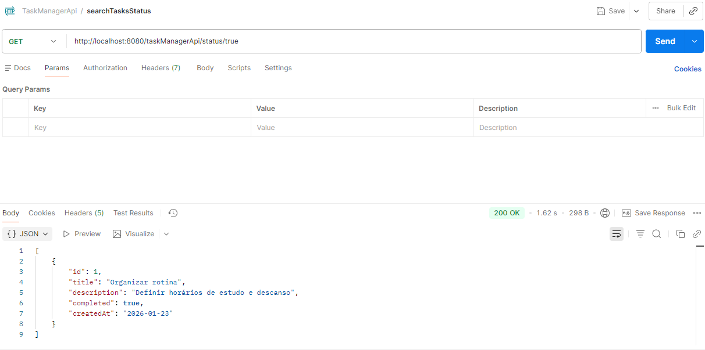
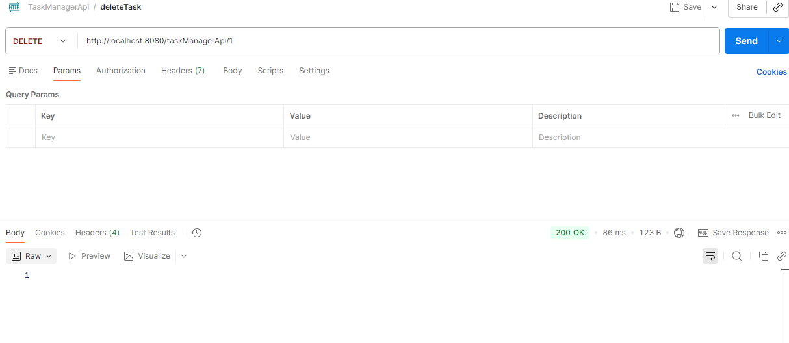
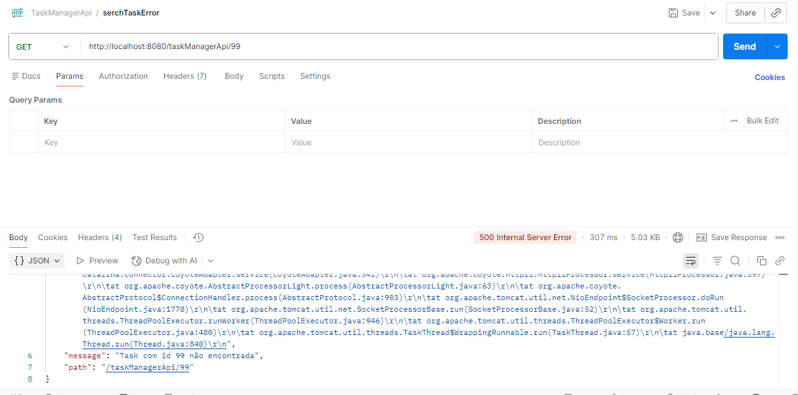

# 📝 Task Manager API

API REST desenvolvida com **Spring Boot** para gerenciamento de tarefas (tasks), permitindo criar, listar, buscar, atualizar e remover registros.

Este projeto foi criado com o objetivo de **consolidar conceitos iniciais de Spring Boot**, utilizando arquitetura em camadas, JPA e testes de API com **Postman**.

---

## 🚀 Tecnologias Utilizadas

- Java 17
- Spring Boot
- Spring Data JPA
- Banco de dados H2
- Maven
- Lombok
- Postman

---

## 🎯 Objetivo do Projeto

Projeto desenvolvido para praticar conceitos iniciais de Spring Boot, API REST e JPA.

---
## 🧱 Arquitetura do Projeto

O projeto segue o padrão de **arquitetura em camadas**, separando responsabilidades:

- **Controller** – exposição dos endpoints REST
- **Service** – regras de negócio e validações
- **Repository** – persistência de dados com JPA
- **Model** – entidade Task
- **Exception** – exceções customizadas

---

## 📌 Endpoints da API

| Método | Endpoint | Descrição |
|------|---------|----------|
| GET | `/taskManagerApi` | Lista todas as tasks |
| GET | `/taskManagerApi/{id}` | Busca uma task por ID |
| GET | `/taskManagerApi/status/{status}` | Lista tasks por status |
| POST | `/taskManagerApi` | Cria uma nova task |
| PUT | `/taskManagerApi/{id}` | Atualiza o status da task |
| DELETE | `/taskManagerApi/{id}` | Remove uma task |

---

## 🔎 Exemplo de Requisição

### ➕ Criar Task
```json
{
  "title": "Estudar Spring Boot",
  "description": "Criar um CRUD simples para consolidar conceitos",
  "completed": false,
  "createdAt": "2026-01-22"
}
```
## ⚠️ Tratamento de Exceções

A API possui **exceções customizadas** para melhorar a comunicação de erros:

- **TaskNotFoundException** – quando a task não é encontrada
- **EmptyTaskListException** – quando não existem tasks cadastradas

---

## 🧪 Testes da API (Postman)

Os endpoints foram testados utilizando o **Postman**, garantindo o correto funcionamento da API.

### ➕ Criar Task
[](postman_tests/createTask_1.png)
[](postman_tests/createTask_2.png)

### 📄 Listar Tasks
[](postman_tests/getAllTasks.png)

### 🔄 Atualizar Status da Task
[](postman_tests/updateTask.png)

### 🔎 Procurar Task pelo Id
[](postman_tests/searchTask.png)

## 🔎 Procurar Task pelo status
[](postman_tests/searchTaskStatus.png)


### ❌ Deletar Task
[](postman_tests/deleteTask.png)

### ❌ Task não encontrada (Exceção)
[](postman_tests/searchTaskError.png)

---

## ▶️ Como Executar o Projeto

1. Clone o repositório:
```bash
git clone https://github.com/Gabrielli-B/task-manager-api


